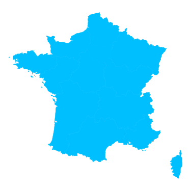
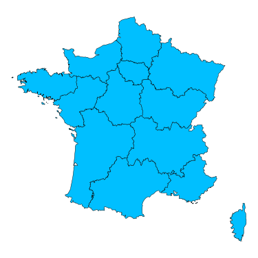
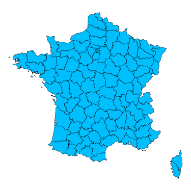

<link rel="stylesheet" href="./style.css">

  <h2>Une approche nationale, régionale ou départementale est possible.</h2>
  <h2>Veuillez sélectionner celle de votre choix ci-dessous.</h2>

  <a href="./1.1.recolte_nationale" class="window">
    Récolte de bois nationale  
    
  </a>
  
  <a href="./1.2.recolte_regionale" class="window">
    Récolte de bois régionale  
    
  </a>
  
  <a href="./1.3.recolte_departementale" class="window">
    Récolte de bois départementale  
    
  </a>

