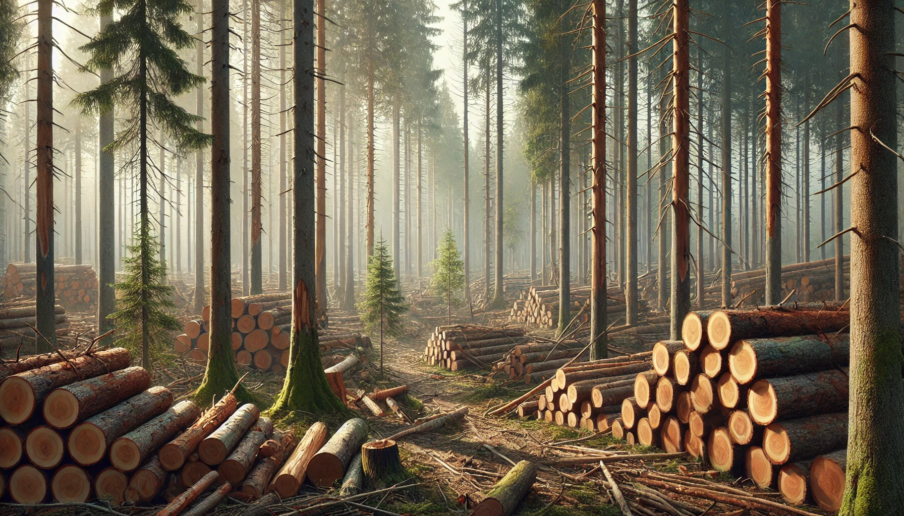

  <h1>Tableau de bord - Enquête EXF-SRI</h1>
  <h2>Bienvenue sur le site de présentation des résultats de l'enquête Exploitations forestières et sciages (EXF-SRI).</h2>

  <a href="https://bastien-pz.github.io/TDB-EXFSRI/1.recolte" class="window">
    Récolte de bois  
    
  </a>
  
  <a href="https://bastien-pz.github.io/TDB-EXFSRI/2.sciages" class="window">
    Production de sciages  
    
  </a>
  
  <a href="https://bastien-pz.github.io/TDB-EXFSRI/3.connexes" class="window">
    Produits connexes  
  </a>

  <a href="https://bastien-pz.github.io/TDB-EXFSRI/4.methodo" class="window">
    Source et méthodologie
  </a>

  <a href="https://bastien-pz.github.io/TDB-EXFSRI/5.pour_en_savoir_plus" class="window">
    Pour en savoir plus
  </a>

  <a href="https://bastien-pz.github.io/TDB-EXFSRI/6.a_propos" class="window">
    À propos
  </a>

